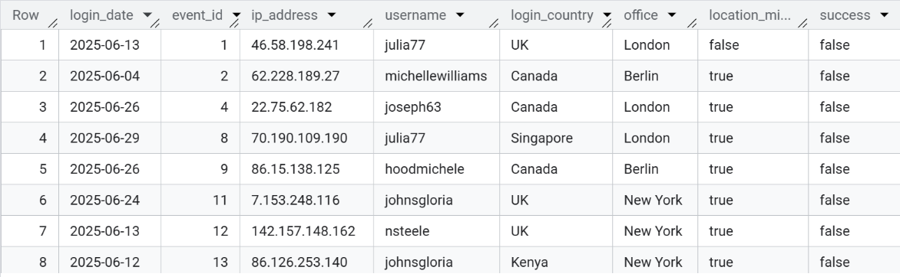
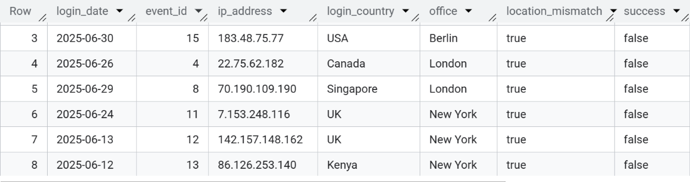
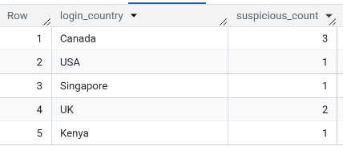
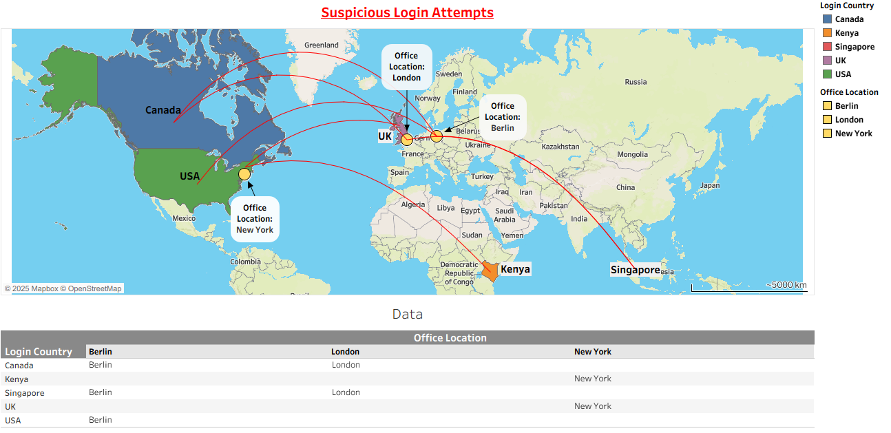

## Query 1 - Join login attempts with employee office information

-   Compute location mismatches by comparing login country to office location

```{r sql, eval=FALSE, include=TRUE}
SELECT 
    l.login_date,
    l.event_id,
    l.ip_address,
    l.username,
    l.country AS login_country,
    e.office,
    CASE 
        WHEN e.office = 'New York' AND l.country != 'USA' THEN TRUE
        WHEN e.office = 'Toronto' AND l.country != 'Canada' THEN TRUE
        WHEN e.office = 'London' AND l.country != 'UK' THEN TRUE
        WHEN e.office = 'Berlin' AND l.country != 'Germany' THEN TRUE
        WHEN e.office = 'Singapore' AND l.country != 'Singapore' THEN TRUE
        WHEN e.office = 'Nairobi' AND l.country != 'Kenya' THEN TRUE
        ELSE FALSE
    END AS location_mismatch,
    l.success
FROM Employer_dataset.login_attempt l
JOIN Employer_dataset.employees e
ON l.username = e.username;
```



## Query 2 - Suspicious login Mismatch

-   Filter for failed login attempts with mismatched country/office locations

```{r mism, eval=FALSE, include=TRUE}
SELECT
login_date,
event_id,
ip_address,
login_country,
office,
location_mismatch,
success,
FROM Employer_dataset.joined_table
WHERE success = FALSE AND location_mismatch = TRUE;
```



## Query 3 - Suspicious login counts by country

-   Count the number of failed login with mismatches per country

```{r count, eval=FALSE, include=TRUE}
SELECT 
    login_country, 
    COUNT(*) AS suspicious_count
FROM  Employer_dataset.joined_table
WHERE success = FALSE AND location_mismatch = TRUE
GROUP BY login_country;
```



## Visualization with Tableau

-   Below is a Tableau-generated map showing where login attempts originate from, overlaid with expected office locations


.

## Conclusion

Project Links

GitHub Repository: https://github.com/Wil421-hu/suspicious-login-analysis

Tableau Dashboard: https://public.tableau.com/app/profile/wil.jero/viz/SuspiciousLoginAttempts/Dashboard1

This demo successfully highlights

-  How login attempts from non-office locations can signal unauthorized access attempts.
-  The power of simple SQL logic to reveal potentially malicious activity.
-  Visualization strategies to support investigation and reporting.

**Note: Data used is simulated. No real user data is included.**
