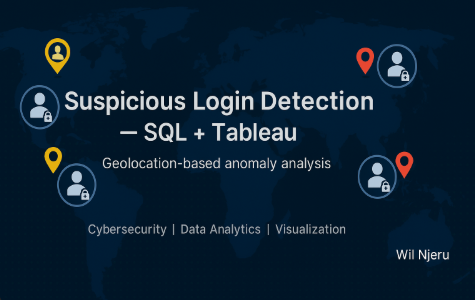

# suspicious-login-analysis
SQL + Tableau demo for detecting suspicious login attempts via location mismatch

#  Suspicious Login Attempts — Cybersecurity Analysis Demo

##  Project Overview
This project simulates the detection of suspicious login activity across a global workforce. Using an AI-generated dataset of employee office locations and login attempts, we perform analytical queries to flag potential unauthorized access based on mismatches in login location.

We apply SQL logic to:
- Join login attempts with employee office records
- Flag logins where the login country does not match expected office
- Filter failed login attempts with mismatches
- Aggregate and visualize anomalies

##  Tools & Technologies
- **R Markdown** — For clean report generation
- **SQL** — Core logic for location mismatch detection
- **Tableau** — Geographic and aggregated visualizations
- **HTML/PDF Output** — For sharing and publishing

##  Project Files

| File | Description |
|------|-------------|
| `suspicious_login_analysis.Rmd` | Main analysis script with SQL queries and visuals |
| `suspicious_login_analysis.pdf` | PDF report output |
| `suspicious_by_country.png` | Bar chart of suspicious login counts |
| `failed_login_mismatch.png` | Screenshot of filtered login anomalies |
| `map_country_office.png` | Tableau-generated map of login vs office |

##  Results
- Multiple login attempts originated from unexpected countries.
- Several failed login attempts were flagged as suspicious.
- Visualizations show clear geographic outliers that may indicate malicious activity.

##  Notes
- **All data is simulated.**
- No real employees or IP addresses are used.
- Intended for demonstration and portfolio purposes.

##  Author
**Wil Njeru**  
Cybersecurity | Data Analytic | professional  
GitHub Profile - https://github.com/Wil421-hu

